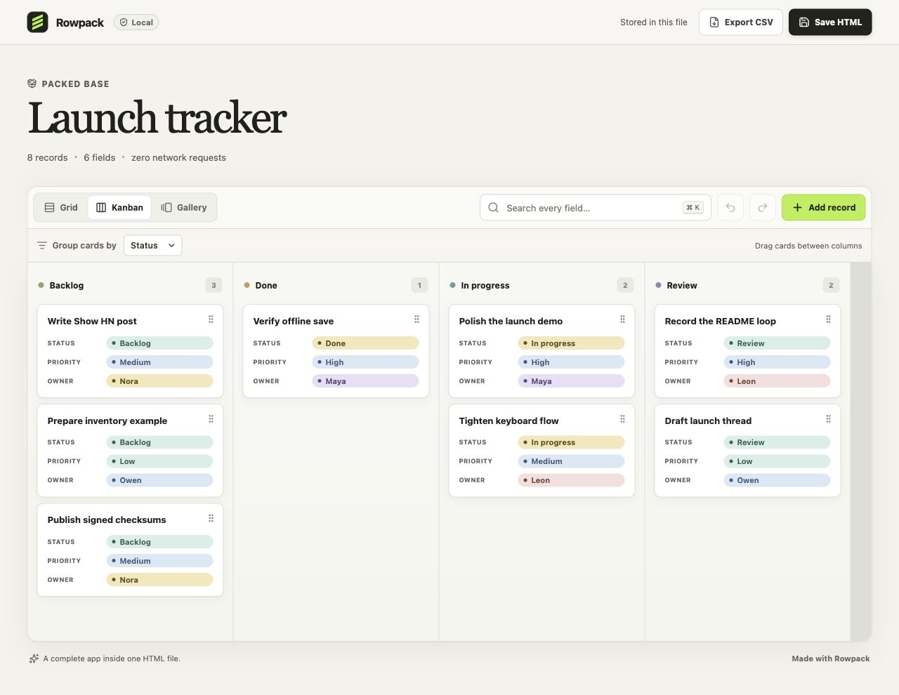

<div align="center">
  
  <h1>Rowpack</h1>
  <p><strong>Airtable in one HTML file.</strong></p>
  <p>Turn CSV, TSV or JSON into a private, editable data app you can open, use and share without a server.</p>

  <p>
    <a href="https://github.com/victus17/rowpack/actions/workflows/ci.yml"></a>
    <a href="https://github.com/victus17/rowpack/releases/latest"></a>
    <a href="LICENSE"></a>
    <a href="https://github.com/victus17/rowpack/stargazers"></a>
  </p>

  <p>
    <a href="https://victus17.github.io/rowpack/"><strong>Try the live demo</strong></a>
    ·
    <a href="#quick-start">Quick start</a>
    ·
    <a href="#how-the-file-works">How it works</a>
  </p>
</div>



Rowpack packs your data, the interface and the editing logic into a single `.html` file. Double-click it and you get a polished grid, Kanban board and gallery. Edit records, search every field, drag cards, then save the whole app back to HTML.

No account. No database. No telemetry. No runtime network requests.

## Quick start

Install the signed release package directly from GitHub:

```bash
npm install --global https://github.com/victus17/rowpack/releases/download/v0.1.0/rowpack-0.1.0.tgz
```

Pack a spreadsheet export:

```bash
rowpack customers.csv
```

Rowpack creates `customers.html` next to the source file. Open it in a browser; the original CSV is no longer needed.

Want a Kanban board immediately?

```bash
rowpack launch.csv \
  --title "Launch tracker" \
  --view kanban \
  --group-by Status
```

You can also run from source:

```bash
git clone https://github.com/victus17/rowpack.git
cd rowpack
corepack enable
pnpm install
pnpm build
node dist/cli/index.js examples/launch-tracker.csv --view kanban
```

## Why it feels different

- **The artifact is the app.** Email it, put it on a USB drive, archive it or keep it in a project folder.
- **Editing stays local.** Rowpack makes zero network requests at runtime and ships with a restrictive Content Security Policy.
- **Views are built in.** Switch between a dense grid, draggable Kanban board and visual gallery without rebuilding.
- **Useful types are inferred.** Dates, numbers, booleans, email addresses, URLs and select-like columns get the right treatment automatically.
- **The file can save itself.** In supported browsers, “Save HTML” updates the opened file. Everywhere else, Rowpack downloads a fresh copy.
- **It remains ordinary data.** Export the current state to CSV at any time.
- **It works on small screens.** The interface is responsive, keyboard-friendly and respects reduced-motion preferences.

## A 10-second mental model

```text
customers.csv  →  rowpack customers.csv  →  customers.html
                                               ├─ data
                                               ├─ UI
                                               └─ editing logic
```

That last file is self-contained. There is no hidden service keeping it alive.

## CLI reference

```text
Usage: rowpack [options] <input>

Arguments:
  input                       path to a CSV, TSV or JSON file

Options:
  -V, --version               output the version number
  -o, --output <file>         output HTML path
  -t, --title <title>         title shown inside the app
  -d, --description <text>    short dataset description
  -g, --group-by <column>     column used for Kanban groups
  -v, --view <view>           grid, kanban or gallery (default: grid)
  -h, --help                  display help
```

Input notes:

- CSV and TSV files use the first row as column labels.
- JSON input must be an array of objects.
- Column labels are preserved in the UI.
- Empty cells remain empty; nested JSON values are displayed as compact JSON text.

## How the file works

The compiler builds the Preact interface into one inlined runtime and embeds the validated dataset in a non-executable JSON script element. When you save, Rowpack serializes the current document back into that element and downloads—or directly writes—a new standalone file.

The generated app contains:

- no remote scripts, styles, fonts or images;
- no analytics, cookies or background sync;
- `connect-src 'none'` and a restrictive default-deny Content Security Policy;
- CSV formula-injection protection on export;
- escaped embedded JSON to prevent script-boundary injection.

The full threat model and limitations live in [docs/security-model.md](docs/security-model.md).

## Good fits

Rowpack is especially useful for:

- project handoffs and client deliverables;
- inventories, content calendars and launch trackers;
- research datasets and field notes;
- offline or air-gapped work;
- portable read/write snapshots;
- small internal tools that do not deserve a backend.

## Honest limits

Rowpack is intentionally not a hosted collaborative database. It has no real-time multi-user sync, permissions layer, server-side validation or automatic backups. The HTML file contains its records in readable form, so filesystem access is the security boundary—do not treat the file as encrypted.

For very large datasets, a server-backed database or a virtualized desktop application will be a better fit. Rowpack optimizes for portable, human-scale datasets and durable handoffs.

## Browser support

The generated file targets current Chrome, Edge, Firefox and Safari releases.

- Direct in-place saving uses the File System Access API where available.
- Other browsers receive a normal `.html` download.
- Everything except direct overwrite works without browser-specific APIs.

## Development

Rowpack uses Node.js 22.12+ and pnpm 11.

```bash
pnpm install
pnpm dev
pnpm check
```

`pnpm check` runs formatting, linting, strict TypeScript checks, unit tests, the production build and desktop/mobile browser tests.

The architecture is described in [docs/architecture.md](docs/architecture.md).

## Contributing

Small, focused contributions are welcome. Start with [CONTRIBUTING.md](CONTRIBUTING.md), or open a [discussion](https://github.com/victus17/rowpack/discussions) if you want to shape a larger change.

If Rowpack saves you from building one more CRUD backend, consider [starring the repository](https://github.com/victus17/rowpack). It helps other people find the project.

## License

MIT © [victus17](https://github.com/victus17)
